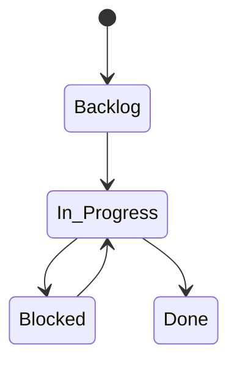
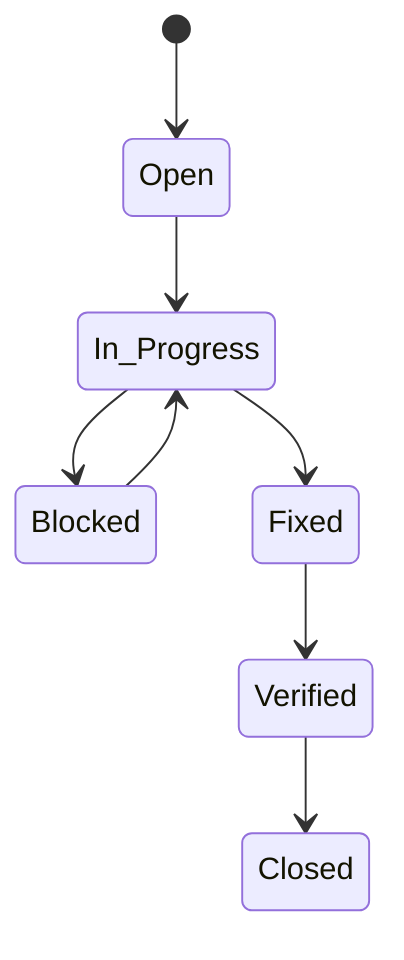
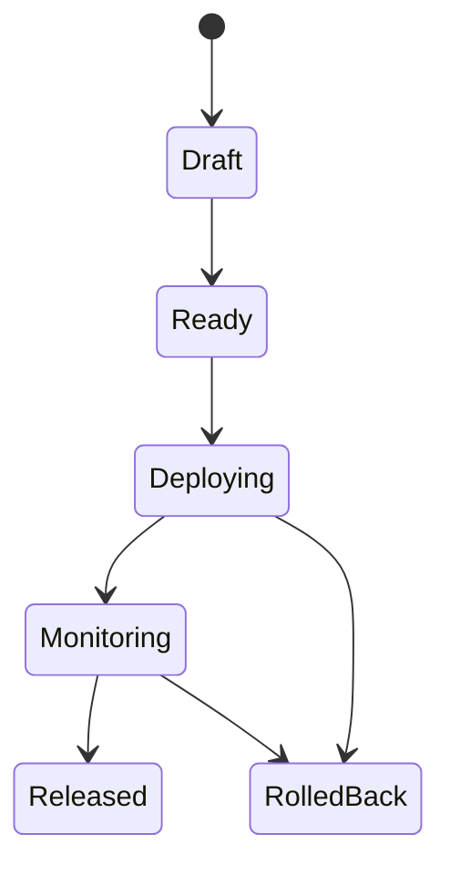

# MCP 字段字典与状态机（MVP版）

目标：在“上线可用”优先的前提下，让 PO/QA/SRE 能按此快速配置 MCP（推荐 GitHub Projects 或同类工具）。

## 对象一：Feature
### 字段（≤5）
- owner：负责人（GitHub 用户名或团队）
- due：截止日期（Date）
- priority：P1/P2/P3（单选）
- status：Backlog/In Progress/Blocked/Done（单选）
- release：关联 Release（文本，填写 Release Issue/卡片ID）

### 状态机（Mermaid）

### 验收口径
- Done 必须满足：有对应 PR，且 PR 已合并；描述中包含验证结果

## 对象二：Bug
### 字段（≤5）
- severity：P0/P1/P2/P3（单选）
- owner：负责人
- due：截止日期
- status：Open/In Progress/Blocked/Fixed/Verified/Closed（单选）
- release：关联 Release（文本）

### 状态机（Mermaid）

### 门禁
- P0/P1 必须关联某个 Release；在 Release “可发布”前，P0/P1 必须为 Closed

## 对象三：Release
### 字段（≤5）
- checklist_status：not_started/in_progress/completed（单选）
- rollback_verified：true/false（布尔）
- canary_stage：none/1%/10%/50%/100%（单选）
- status：Draft/Ready/Deploying/Monitoring/Released/RolledBack（单选）
- owner：负责人（一般为 SRE 或 Tech Lead）

### 状态机（Mermaid）

### “可发布(Ready)”验收标准
- checklist_status = completed
- rollback_verified = true
- P0/P1 缺陷清零（Closed）
- CI 全绿（核心链路）

