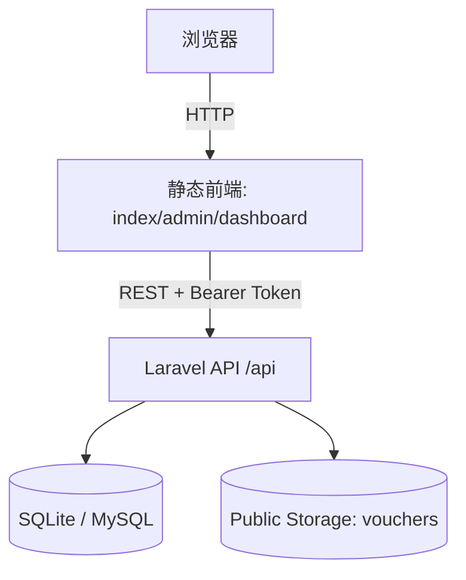
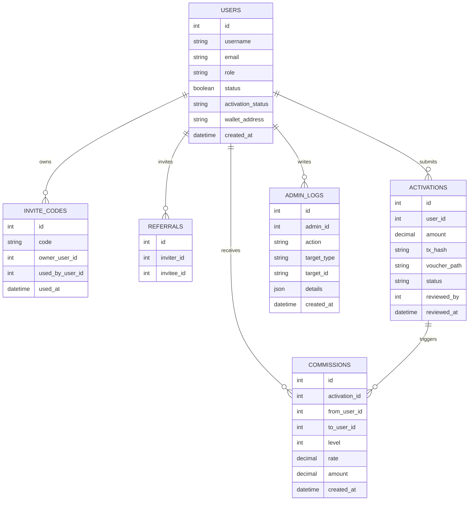

# 架构与依赖可视化

## 运行时架构（组件图）

## 数据模型（ER 图）

## 前端质量可视化（已生成）
- Plato 报告入口：[reports/plato/index.html](file:///E:/make/CZOWPcVFHILt2YYVJOp0-master-6d735223c1f1d4da5289c50b873d3d8cb50f54d3/reports/plato/index.html)

## 依赖清单（摘要）
- 后端：Laravel 12 + Sanctum（Token 鉴权）
- 前端：Tailwind（CDN）、DaisyUI（CDN）、FontAwesome（CDN）

